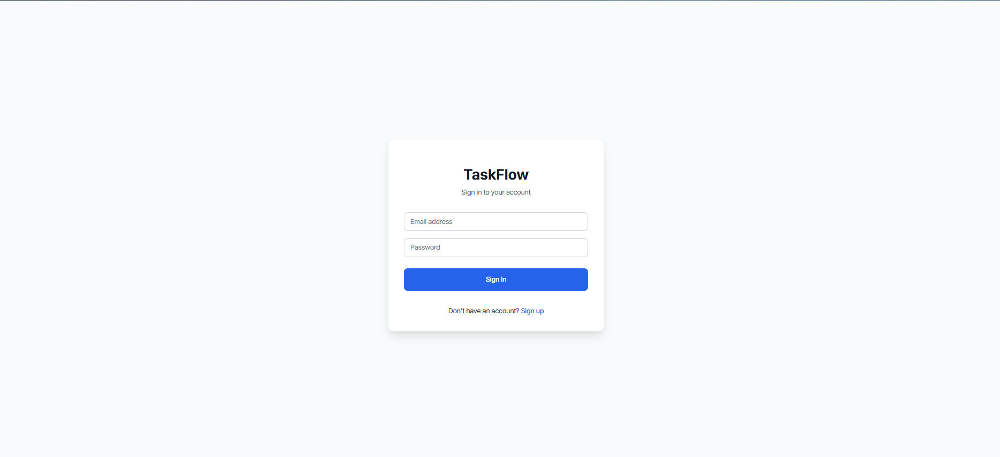
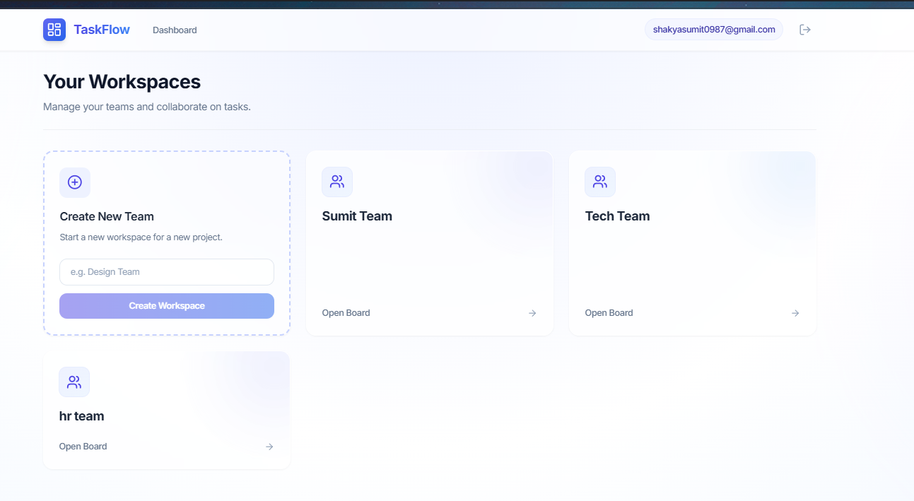

# Task Management System

A full-stack, team-based task management application with a secure REST API, real-time database, and strict workflow enforcement.

 
 


## Tech Stack

*   **Frontend:** React.js (Vite), Tailwind CSS, React Router
*   **Backend:** Node.js, Express.js
*   **Database & Authentication:** Supabase (PostgreSQL, JWT Auth)

## Environment Variables Setup

Before running the project, you need to set up your environment variables. 
Create a `.env` file in both the `frontend` and `backend` directories using the provided example files.

### Backend (`backend/.env`)
```env
PORT=5000
SUPABASE_URL=https://<your-project-ref>.supabase.co
SUPABASE_SERVICE_ROLE_KEY=<your-service-role-key>
```

### Frontend (`frontend/.env`)
```env
VITE_SUPABASE_URL=https://<your-project-ref>.supabase.co
VITE_SUPABASE_ANON_KEY=<your-anon-key>
VITE_API_URL=http://localhost:5000/api
```

## How to Run Locally

You will need two terminals open to run both the frontend and backend servers simultaneously.

**1. Start the Backend Server**
```bash
cd backend
npm install
npm run dev
```
*The backend API will start running on http://localhost:5000*

**2. Start the Frontend Server**
```bash
cd frontend
npm install
npm run dev
```
*The React frontend will start running. Open the URL provided in the terminal (usually http://localhost:5173).*
